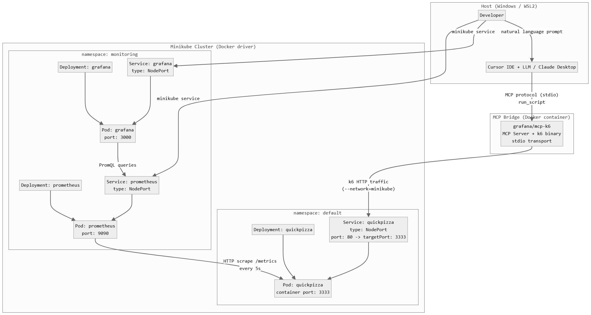

# MCP-K6 Application Testing with k6 Controlled by MCP

## Project Documentation

### Title Page
**Acronym – Title:**  
MCP-K6 – Application testing with k6 controlled by MCP

**Authors:**  
Szymon Szarek, Hubert Tułacz, Piotr Śmiałek, Tomasz Furgała

**Year, Group:**  
2026, 2

---

## Contents

1. [Introduction](#1-introduction)  
2. [Theoretical Background / Technology Stack](#2-theoretical-background--technology-stack)  
3. [Case Study Concept Description](#3-case-study-concept-description)  
4. [Case Study High-Level Architecture](#4-case-study-high-level-architecture)  
5. [Case Study Detailed Architecture](#5-case-study-detailed-architecture)  
6. [Environment Configuration Description](#6-environment-configuration-description)  
7. [Installation Method](#7-installation-method)  
8. [Demo Deployment Steps](#8-demo-deployment-steps)  
9. [Demo Description](#9-demo-description)  
10. [Summary – Conclusions](#10-summary--conclusions)  
11. [References](#11-references)

---

## 1. Introduction

The goal of this project is to demonstrate an automated application performance testing workflow using **k6 load testing controlled through an MCP server and LLM interface**.  

The tested application is deployed in a **Kubernetes cluster**, while load testing scenarios are executed using k6. The results of application performance and system behavior are visualized using Grafana dashboards.

The project demonstrates how modern observability tools and AI-driven control interfaces can be integrated to manage application testing and performance analysis.

---
## 2. Theoretical Background / Technology Stack

This project combines several modern DevOps and observability tools used for application deployment, performance testing, and monitoring.

**k6** is an open-source load testing tool used to simulate user traffic and evaluate application performance under load. Test scenarios are defined using JavaScript and allow the simulation of multiple virtual users interacting with application endpoints. In this project, the load tests target a ready demo web service based on the **QuickPizza** application.

**Kubernetes** is used as a container orchestration platform responsible for deploying and managing the application within a cluster environment.

The project also incorporates the **Model Context Protocol (MCP)**, which enables interaction between Large Language Models (LLMs) and external tools. Through an MCP server, the LLM can trigger and control load testing scenarios executed by k6.

For monitoring and observability, the project uses **Prometheus** and **Grafana**. Prometheus collects time-series metrics from the application and infrastructure, while Grafana provides dashboards for visualizing system behavior during load tests.

Together, these technologies form a pipeline for automated performance testing and observability of the deployed application.

---
## 3. Case Study Concept Description

This proof-of-concept evaluates the efficacy of LLM-driven control over performance testing within a Kubernetes-native environment. By leveraging a representative microservices architecture (QuickPizza-style), we demonstrate a shift from the LLM acting as a passive advisor to an active operational controller.

The core of this system is an integrated pipeline that bridges the gap between natural language intent and infrastructure reality.

- **Natural-Language Intent:** The user defines goals in plain English.  
- **MCP-Mediated Execution:** The Model Context Protocol (MCP) exposes k6 as executable tools. The model dynamically sets VUs, duration, and stages.  
- **Induced Load:** k6 generates synthetic traffic against in-cluster URLs.  
- **Multi-Signal Observability:** Prometheus and Grafana provide time-series evidence, allowing the LLM to interpret results and iterate.  

This represents an integrated human-LLM-tool-system pipeline for operational performance assessment, focusing on:

- Reproducibility  
- Action traceability  
- Management of LLM/tooling limitations through formal guardrails  

The following strategies are implemented to evaluate system stability and limits:

| Test Type              | Description                          | Objective                                                   |
|----------------------|--------------------------------------|-------------------------------------------------------------|
| **Smoke Testing**     | Minimal load                         | Verify scripts work and the system is responsive            |
| **Average-Load**      | Expected daily traffic               | Assess standard performance baselines                       |
| **Stress Testing**    | High load beyond limits              | Identify bottlenecks and observe degradation                |
| **Spike Testing**     | Sudden, extreme surges               | Test stability and autoscaling responsiveness               |
| **Soak (Endurance)**  | Prolonged duration                  | Uncover long-term issues like memory leaks                  |
| **Breakpoint**        | Continuous load increase             | Find absolute physical limits until system crash            |

---
## 4. Case Study High-Level Architecture


---
## 5. Case Study Detailed Architecture

The system consists of three layers: the **host environment** (developer machine), the **MCP bridge** (Docker container), and the **Kubernetes cluster** (Minikube).



---
## 6. Environment Configuration Description

### Required Software
| Software | Version | Purpose |
|----------|---------|---------|
| Docker Desktop | 28+ | Container runtime, Minikube driver, MCP server host |
| Minikube | 1.30+ | Local single-node Kubernetes cluster |
| kubectl | matching K8s version | Kubernetes CLI client |
| Cursor IDE or Claude Desktop | latest | IDE/App with MCP client support and LLM integration |

### Project Structure
```
k6-mcp-load-testing/
├── .cursor/
│   └── mcp.json              # MCP server config for Cursor
├── .mcp.json                 # MCP server config for Claude Code
├── k8s/
│   ├── quickpizza.yaml       # QuickPizza Deployment + Service
│   └── monitoring.yaml       # Prometheus + Grafana stack
├── k6-tests/                 # Folder with pre-written k6 JS scripts
├── commands.md               # Quick-reference Minikube/K8s commands
└── README.md                 # This documentation
```

---
## 7. Installation Method

1. **Ensure Requirements are Met:** 
   Docker Desktop must be running. If on Windows, WSL2 is highly recommended.
2. **Clone Repository:**
   ```bash
   git clone <repository-url>
   cd k6-mcp-load-testing
   ```
3. **Pull Necessary Docker Images:**
   ```bash
   docker pull ghcr.io/grafana/quickpizza-local:latest
   docker tag ghcr.io/grafana/quickpizza-local:latest quickpizza:latest
   docker pull grafana/mcp-k6:latest
   ```

---
## 8. Demo Deployment Steps

The fastest way to deploy the entire environment (Minikube, QuickPizza, Prometheus, Grafana) is by using the provided setup script.

1. **Run the Infrastructure Script:**
   Open a terminal (preferably WSL or Git Bash) in the project root and run:
   ```bash
   bash scripts/setup-infrastructure.sh
   ```
   *Note: At the end of the script execution, it will print a `BASE_URL` (e.g., `http://192.168.49.2:31652`). Copy this URL as it is required for your AI prompts.*

2. **Open Monitoring Tunnels:**
   In order to access Prometheus and Grafana from your browser, open two **new background terminals** and run:
   ```bash
   minikube service prometheus -n monitoring
   minikube service grafana -n monitoring
   ```

3. **Log into Grafana:**
   The browser will open Grafana. Use **`admin` / `admin`** to log in. Navigate to *Dashboards -> QuickPizza -> QuickPizza - Load Testing Overview* to see the live metrics.

---
## 9. Demo Description

The demo showcases a complete loop: **human intent → LLM interpretation → MCP-mediated k6 execution → observable system response**.

To run the tests via LLM, you can use either **Cursor** or **Claude Desktop**. They differ significantly in how they handle local files.

### 9.1 AI Integration & Prompts

#### Option A: Using Cursor IDE (Recommended)
Cursor automatically loads the `.cursor/mcp.json` file and has native access to your workspace files. You only need to type the prompt in the AI Chat (Ctrl+L).

#### Option B: Using Claude Desktop (Manual Setup Required)
Claude Desktop is a standalone GUI and **cannot read your local files automatically**. 
1. You must manually add the MCP server configuration in Claude Desktop (`Settings -> Developer -> Edit Config`). *Crucial: ensure `"--network=minikube"` is in the args!*
2. To run a test script (e.g., `smoke.js`), you must **Drag & Drop** the file from your File Explorer into the Claude Desktop chat window so the LLM can read its contents before running the prompt.

#### Example Prompts
Copy and paste these prompts into your LLM chat. Replace `<BASE_URL>` with the URL you got from the setup script.

* **Smoke Test**
  > "Run the 'smoke' test using the k6 MCP server. Use the attached/provided `k6-tests/smoke.js` file. Set the environment variable BASE_URL to: `<BASE_URL>`"

* **Average Load Test**
  > "Execute the 'average-load' test via the k6 MCP plugin. The script is in `k6-tests/average-load.js`. Set BASE_URL=`<BASE_URL>`. Once finished, report the 95th percentile (p95) response time."

* **Stress Test**
  > "Perform a 'stress test' against QuickPizza using k6 MCP and the `k6-tests/stress.js` script. Target BASE_URL=`<BASE_URL>`. Analyze the results and tell me at what VU count the application started to slow down."

* **Breakpoint Test**
  > "Execute a 'breakpoint test' to find the absolute physical limit of the application. Use `k6-tests/breakpoint.js` and BASE_URL=`<BASE_URL>`. Review the summary and tell me at what request rate the server first broke its SLA and returned timeouts or 500 errors."

### 9.2 Troubleshooting Common Issues

* **Error: `invalid option ... set: pipefail` when running the setup script**
  * **Cause:** The `setup-infrastructure.sh` script has Windows CRLF line endings instead of Unix LF.
  * **Fix:** Change Line Endings to `LF` in your code editor and save, or run `dos2unix scripts/setup-infrastructure.sh`.

* **Error: `dial: i/o timeout` when running a test via Claude Desktop**
  * **Cause:** The k6 Docker container was not attached to the Minikube network.
  * **Fix:** Open your Claude Desktop config (`%APPDATA%\Claude\claude_desktop_config.json`) and ensure `"--network=minikube"` is present in the `args` array for the `k6` tool.

* **Error: Claude Desktop says "I don't have access to the file k6-tests/...js"**
  * **Cause:** Claude Desktop cannot read local drives.
  * **Fix:** Drag and drop the `.js` file from your File Explorer directly into the Claude Desktop chat window before sending your prompt.

* **Error: The setup script hangs at the "Summary" phase**
  * **Cause:** In WSL, the `minikube service --url` command opens an infinite foreground SSH tunnel.
  * **Fix:** Press `Ctrl+C` to exit the script (everything is already deployed). Retrieve the URL manually by running:
    `echo "http://$(minikube ip):$(kubectl get svc quickpizza -o jsonpath='{.spec.ports[0].nodePort}')"`

* **Error: `docker: error during connect: Head ... The system cannot find the file specified` in Cursor**
  * **Cause:** The `docker.exe` process cannot contact the Docker Desktop background service.
  * **Fix:** Restart the Docker Desktop application on Windows.

---
## 10. Summary – Conclusions

This project demonstrates that **LLM-driven performance testing is practical and effective** for Kubernetes-deployed applications. 

1. **MCP as a bridge** — The Model Context Protocol successfully connects an LLM to k6, enabling natural-language-driven test execution.
2. **Observable pipeline** — The combination of Prometheus metrics and Grafana dashboards provides real-time visibility into application behavior under load.
3. **Reproducible workflow** — Pre-built test scripts (`k6-tests/`) cover the standard load testing taxonomy, ensuring systematic evaluation.

*Note: Complex multi-step testing workflows still benefit from human oversight, as the LLM primarily relies on k6's textual output rather than real-time visual dashboards.*

---
## 11. Screenshots


---
## 12. References

- k6 Documentation  
https://grafana.com/docs/k6/latest/

- k6 MCP Server  
https://github.com/QAInsights/k6-mcp-server

- Grafana Documentation  
https://grafana.com/docs/

- Kubernetes Documentation  
https://kubernetes.io/docs/

- QuickPizza 
https://github.com/grafana/quickpizza
